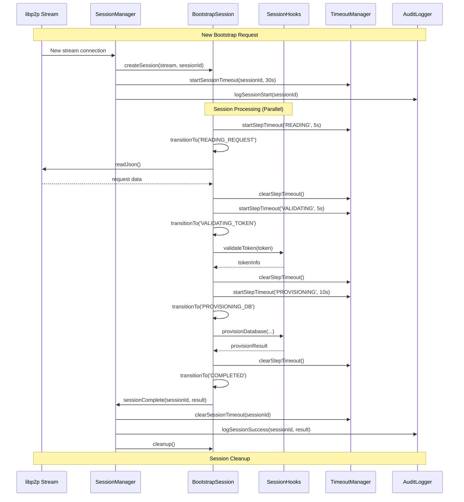
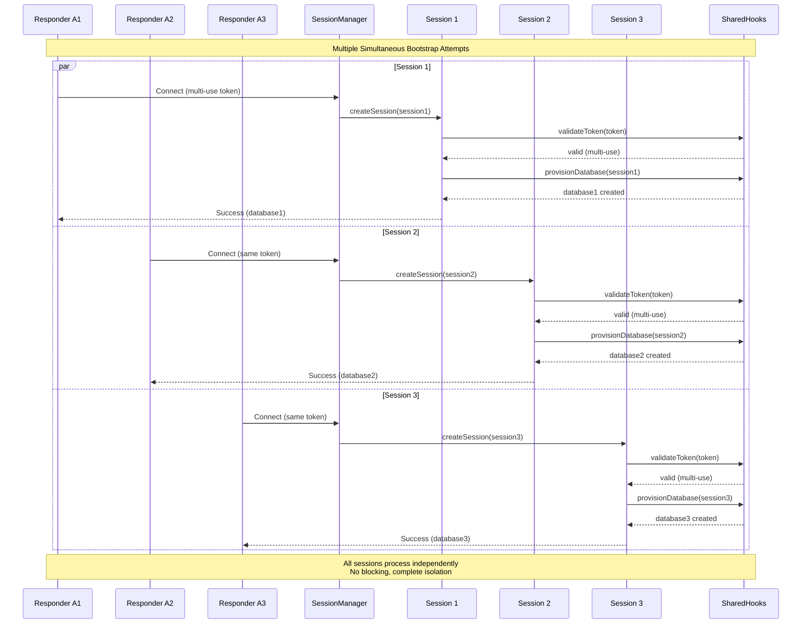
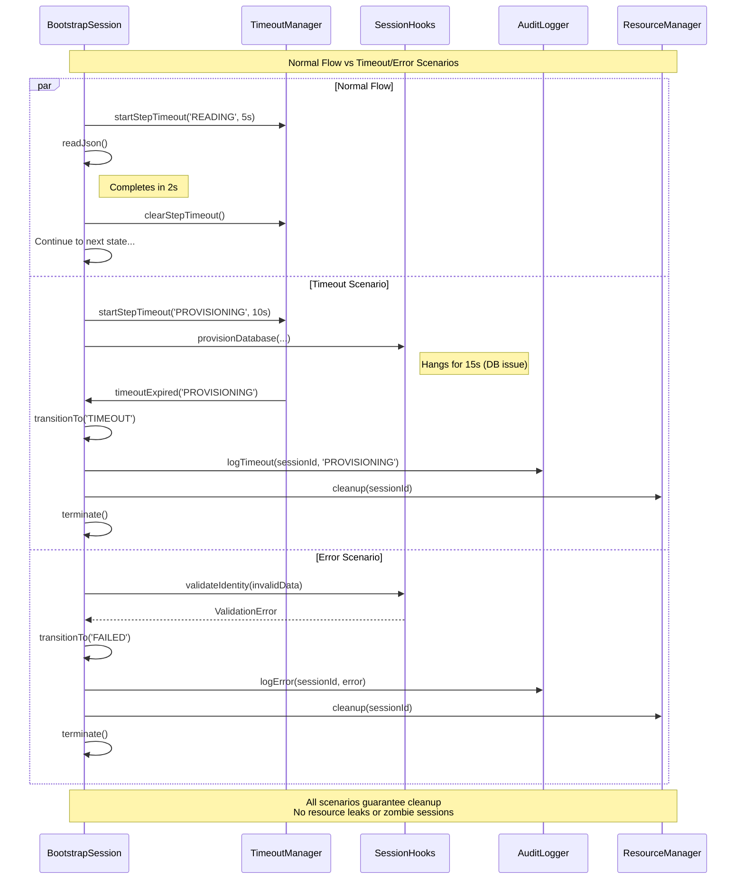

# Taleus Bootstrap: State Machine Architecture

This guide explains the production state machine architecture for Taleus bootstrap. The bootstrap process establishes shared databases and minimal draft tallies between two parties to enable tally negotiation.

## State Machine Overview

The Taleus bootstrap uses a **session-based state machine** architecture optimized for concurrent processing, fault tolerance, and production money system requirements.

### Key Design Principles

- **Session Independence**: Each bootstrap attempt runs in an isolated session
- **Concurrent Processing**: Unlimited parallel bootstrap sessions
- **Timeout Protection**: Multi-level timeouts prevent hangs and resource leaks
- **Error Isolation**: Failed sessions don't affect other sessions
- **Resource Management**: Automatic cleanup and monitoring
- **Audit Trail**: Complete logging for money system compliance

---

## Session State Diagram

```mermaid
stateDiagram-v2
    [*] --> CREATED: New stream arrives
    
    CREATED --> READING_REQUEST: Start processing
    READING_REQUEST --> VALIDATING_TOKEN: Request received
    VALIDATING_TOKEN --> VALIDATING_IDENTITY: Token valid
    VALIDATING_TOKEN --> FAILED: Invalid token
    
    VALIDATING_IDENTITY --> PROVISIONING_DB: Identity valid
    VALIDATING_IDENTITY --> FAILED: Identity rejected
    VALIDATING_IDENTITY --> PROVISIONING_DB: No identity required
    
    PROVISIONING_DB --> SENDING_RESPONSE: Database created
    PROVISIONING_DB --> FAILED: Provisioning failed
    
    SENDING_RESPONSE --> AWAITING_ACK: Response sent (foil role)
    SENDING_RESPONSE --> COMPLETED: Response sent (stock role)
    
    AWAITING_ACK --> COMPLETED: Ack received
    AWAITING_ACK --> TIMEOUT: Ack timeout
    
    READING_REQUEST --> TIMEOUT: Read timeout
    VALIDATING_TOKEN --> TIMEOUT: Validation timeout
    VALIDATING_IDENTITY --> TIMEOUT: Identity timeout
    PROVISIONING_DB --> TIMEOUT: Provisioning timeout
    SENDING_RESPONSE --> TIMEOUT: Send timeout
    
    FAILED --> [*]: Cleanup & log
    TIMEOUT --> [*]: Cleanup & log
    COMPLETED --> [*]: Cleanup & log
    
    note right of TIMEOUT: Multi-level timeouts:<br/>- Overall session: 30s<br/>- Per step: 5s
    note right of FAILED: Error isolation:<br/>- Stream cleanup<br/>- Resource release<br/>- Audit logging
```

---

## Session Management Architecture



---

## Concurrent Session Handling



---

## Session Timeout and Error Handling



---

## Production Architecture Overview

### SessionManager Class Design

```typescript
class SessionManager {
  private sessions = new Map<string, BootstrapSession>()
  private metrics = new SessionMetrics()
  private rateLimiter = new RateLimiter()
  
  async handleNewStream(stream: LibP2PStream): Promise<void> {
    // Rate limiting check
    if (!this.rateLimiter.allowConnection(stream.remotePeer)) {
      await this.rejectConnection(stream, 'rate_limited')
      return
    }
    
    // Create isolated session
    const sessionId = this.generateSessionId()
    const session = new BootstrapSession(sessionId, stream, this.hooks)
    
    this.sessions.set(sessionId, session)
    this.metrics.trackSessionStart(sessionId)
    
    // Process session independently (non-blocking)
    this.processSession(sessionId).finally(() => {
      this.cleanupSession(sessionId)
    })
  }
}
```

### BootstrapSession Class Design

```typescript
class BootstrapSession {
  private state: SessionState = 'CREATED'
  private timeouts = new SessionTimeouts()
  private audit = new SessionAudit(this.sessionId)
  
  async processSession(): Promise<SessionResult> {
    try {
      await this.transitionTo('READING_REQUEST')
      const request = await this.readRequest()
      
      await this.transitionTo('VALIDATING_TOKEN') 
      const tokenInfo = await this.validateToken(request.token)
      
      if (tokenInfo.identityRequirements) {
        await this.transitionTo('VALIDATING_IDENTITY')
        await this.validateIdentity(request.identityBundle)
      }
      
      await this.transitionTo('PROVISIONING_DB')
      const dbResult = await this.provisionDatabase(tokenInfo, request)
      
      await this.transitionTo('SENDING_RESPONSE')
      await this.sendResponse(dbResult)
      
      if (this.needsAcknowledgment(tokenInfo.role)) {
        await this.transitionTo('AWAITING_ACK')
        await this.awaitAcknowledgment()
      }
      
      return this.transitionTo('COMPLETED')
    } catch (error) {
      return this.transitionTo('FAILED', error)
    }
  }
}
```

### SessionHooks Interface (Clean Design)

```typescript
interface SessionHooks {
  token: {
    validate(token: string): Promise<TokenInfo>
    markUsed(token: string, sessionId: string): Promise<void>
  }
  
  identity: {
    validate(bundle: unknown, requirements: unknown): Promise<boolean>
  }
  
  database: {
    provision(
      createdBy: PartyRole,
      initiatorPeerId: string, 
      respondentPeerId: string,
      sessionId: string
    ): Promise<DatabaseResult>
  }
  
  audit: {
    logSession(sessionId: string, event: SessionEvent): Promise<void>
  }
}
```

---

## Integration Guide

### Quick Start

```typescript
import { SessionManager, SessionHooks } from 'taleus/bootstrap'
import { createLibp2p } from 'libp2p'

// 1. Implement session hooks
const hooks: SessionHooks = {
  token: {
    async validate(token) {
      // Your token validation logic
      return { initiatorRole: 'stock', expiryUtc: '...', identityRequirements: null }
    },
    async markUsed(token, sessionId) {
      // Mark token as used (for one-time tokens)
    }
  },
  
  database: {
    async provision(createdBy, initiatorPeerId, respondentPeerId, sessionId) {
      // Your database creation logic
      return { tally: { tallyId: 'tally-123', createdBy }, dbConnectionInfo: { ... } }
    }
  },
  
  // ... other hooks
}

// 2. Create session manager
const sessionManager = new SessionManager(hooks, {
  sessionTimeoutMs: 30000,
  stepTimeoutMs: 5000,
  maxConcurrentSessions: 100,
  rateLimitPerPeer: 10
})

// 3. Register with libp2p
const node = await createLibp2p({ /* config */ })
sessionManager.registerWithLibP2P(node)

// 4. For initiating bootstraps
const result = await sessionManager.initiateBootstrap(link, node)
```

### Configuration Options

```typescript
interface SessionManagerConfig {
  // Timeout settings
  sessionTimeoutMs: number        // Total session timeout (default: 30000)
  stepTimeoutMs: number          // Per-step timeout (default: 5000)
  
  // Concurrency limits  
  maxConcurrentSessions: number  // Max parallel sessions (default: 100)
  rateLimitPerPeer: number      // Max sessions per peer/minute (default: 10)
  
  // Resource management
  cleanupIntervalMs: number     // Session cleanup frequency (default: 10000)
  maxSessionHistory: number     // Audit log retention (default: 1000)
  
  // Monitoring
  metricsEnabled: boolean       // Enable metrics collection (default: true)
  auditLevel: 'minimal' | 'full' // Audit detail level (default: 'full')
}
```

---

## Testing Strategy

The state machine architecture enables comprehensive testing:

### Session Lifecycle Tests
- Session creation and initialization
- State transition validation  
- Timeout handling at each state
- Resource cleanup verification

### Concurrent Session Tests
- Multiple simultaneous sessions
- Session isolation verification
- Resource contention testing
- Load testing with 100+ concurrent sessions

### Error Handling Tests
- Network failures and hangs
- Hook timeouts and errors
- Malformed message handling
- Resource exhaustion scenarios

### Production Readiness Tests
- Rate limiting effectiveness
- Graceful shutdown behavior
- Memory leak detection
- Performance under load

This architecture provides the robust, concurrent, fault-tolerant bootstrap infrastructure required for a production money system.
