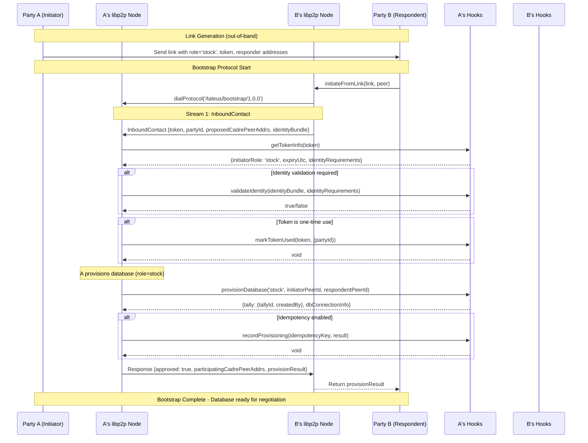
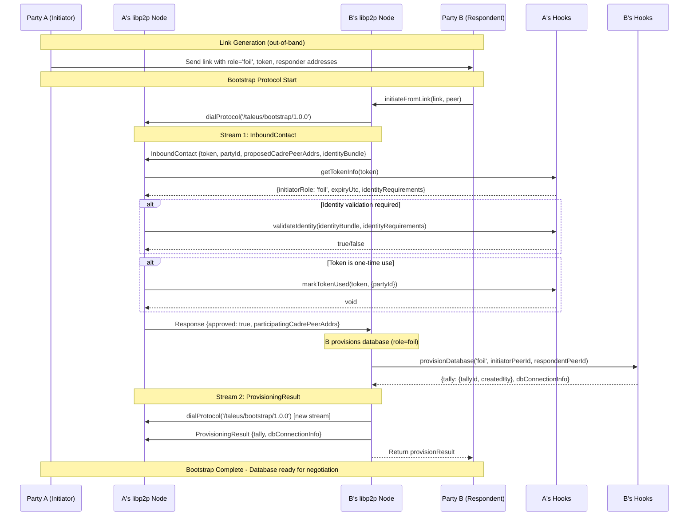

# Taleus Bootstrap Integration Guide

This guide explains how to integrate the `TallyBootstrap` service into your application. The bootstrap process establishes shared databases and minimal draft tallies between two parties to enable tally negotiation.

## Quick Start

```typescript
import { TallyBootstrap } from 'taleus/src/tallyBootstrap'
import { createLibp2p } from 'libp2p'

// 1. Implement required hooks
const hooks = {
  async getTokenInfo(token: string) {
    // Your token validation logic
    return { initiatorRole: 'stock', expiryUtc: '...', identityRequirements: null }
  },
  async provisionDatabase(createdBy, initiatorPeerId, respondentPeerId) {
    // Your database creation logic  
    return { tally: { tallyId: 'tally-123', createdBy }, dbConnectionInfo: { ... } }
  }
}

// 2. Create bootstrap service
const bootstrap = new TallyBootstrap(hooks)

// 3. Register as passive listener (Party A)
const node = await createLibp2p({ /* config */ })
const unregister = bootstrap.registerPassiveListener(node, { role: 'stock' })

// 4. Or initiate from link (Party B)  
const result = await bootstrap.initiateFromLink(link, node)
```

## Consumer Hooks Reference

The `TallyBootstrap` service delegates policy decisions and external integrations to consumer-provided hooks. This keeps the bootstrap logic focused while allowing maximum flexibility for different application requirements.

### Required Hooks

#### `getTokenInfo(token: string)`

**Purpose**: Validate authentication tokens and determine bootstrap parameters.

**Parameters**:
- `token`: The authentication token from the bootstrap link

**Returns**: `Promise<TokenInfo | null>`
```typescript
interface TokenInfo {
  initiatorRole: 'stock' | 'foil'      // Who will provision the database
  expiryUtc: string                    // ISO string, when token expires
  identityRequirements?: unknown       // App-defined identity validation rules
}
```

**Implementation Examples**:

```typescript
// Database-backed token validation
async getTokenInfo(token: string) {
  const tokenRecord = await db.bootstrap_tokens.findOne({ token, active: true })
  if (!tokenRecord || new Date(tokenRecord.expires_at) < new Date()) {
    return null // Invalid or expired token
  }
  
  return {
    initiatorRole: tokenRecord.initiator_role,
    expiryUtc: tokenRecord.expires_at.toISOString(),
    identityRequirements: {
      emailRequired: tokenRecord.require_email,
      kycLevel: tokenRecord.kyc_level,
      allowedDomains: tokenRecord.allowed_domains
    }
  }
}

// Simple in-memory token validation  
const validTokens = new Map([
  ['demo-stock-token', { role: 'stock', expires: '2024-12-31T23:59:59Z' }],
  ['demo-foil-token', { role: 'foil', expires: '2024-12-31T23:59:59Z' }]
])

async getTokenInfo(token: string) {
  const info = validTokens.get(token)
  if (!info || new Date(info.expires) < new Date()) {
    return null
  }
  
  return {
    initiatorRole: info.role,
    expiryUtc: info.expires,
    identityRequirements: { emailRequired: true }
  }
}
```

**Error Handling**:
- Return `null` for invalid, expired, or unknown tokens
- Throw exceptions for system errors (database failures, etc.)
- Invalid tokens result in bootstrap rejection with `invalid_token` reason

---

#### `provisionDatabase(createdBy, initiatorPeerId, respondentPeerId)`

**Purpose**: Create the shared database instance that will host the tally.

**Parameters**:
- `createdBy`: `'stock' | 'foil'` - Which party is provisioning the database
- `initiatorPeerId`: `string` - Peer ID of the party who created the bootstrap link
- `respondentPeerId`: `string` - Peer ID of the party responding to the link

**Returns**: `Promise<ProvisionResult>`
```typescript
interface ProvisionResult {
  tally: {
    tallyId: string                    // Unique identifier for the new tally
    createdBy: 'stock' | 'foil'       // Which party provisioned it
  }
  dbConnectionInfo: {
    endpoint: string                   // How to connect to the database
    credentialsRef: string             // Authentication/access credentials
  }
}
```

**Implementation Examples**:

```typescript
// Quereus/Optimystic integration (future)
async provisionDatabase(createdBy, initiatorPeerId, respondentPeerId) {
  // Create Kademlia DHT network with nominated nodes
  const cadreNodes = await this.getCadreNodes(initiatorPeerId, respondentPeerId)
  const dhtNetwork = await createKadmeliaDHT(cadreNodes)
  
  // Create Optimystic database atop the DHT
  const database = await createOptimysticDB(dhtNetwork)
  
  // Create Quereus SQL layer atop Optimystic
  const quereus = await createQuereusLayer(database)
  
  // Create minimal draft tally
  const tallyId = generateTallyId()
  await quereus.execute(`
    INSERT INTO tallies (id, stock_peer, foil_peer, created_by, status)
    VALUES ($1, $2, $3, $4, 'draft')
  `, [tallyId, initiatorPeerId, respondentPeerId, createdBy])
  
  return {
    tally: { tallyId, createdBy },
    dbConnectionInfo: {
      endpoint: quereus.getConnectionString(),
      credentialsRef: await quereus.generateCredentials()
    }
  }
}

// Mock implementation for testing/development
async provisionDatabase(createdBy, initiatorPeerId, respondentPeerId) {
  const tallyId = `tally-${Date.now()}-${Math.random().toString(36).substr(2, 9)}`
  
  // Simulate database creation delay
  await new Promise(resolve => setTimeout(resolve, 100))
  
  return {
    tally: { tallyId, createdBy },
    dbConnectionInfo: {
      endpoint: `mock://database.example/${tallyId}`,
      credentialsRef: `mock-credentials-${tallyId}`
    }
  }
}

// Cloud database provisioning
async provisionDatabase(createdBy, initiatorPeerId, respondentPeerId) {
  // Create new database instance in cloud provider
  const dbInstance = await cloudProvider.createDatabase({
    name: `tally-${initiatorPeerId}-${respondentPeerId}`,
    region: 'us-east-1',
    permissions: [initiatorPeerId, respondentPeerId]
  })
  
  // Initialize schema
  await dbInstance.executeSQL(`
    CREATE TABLE tallies (...);
    CREATE TABLE chits (...);
    -- etc.
  `)
  
  // Create initial tally record
  const tallyId = uuid.v4()
  await dbInstance.executeSQL(`
    INSERT INTO tallies (id, stock_peer, foil_peer, created_by, status)
    VALUES ($1, $2, $3, $4, 'draft')
  `, [tallyId, initiatorPeerId, respondentPeerId, createdBy])
  
  return {
    tally: { tallyId, createdBy },
    dbConnectionInfo: {
      endpoint: dbInstance.connectionString,
      credentialsRef: dbInstance.accessToken
    }
  }
}
```

**Error Handling**:
- Throw descriptive errors for provisioning failures
- Errors result in bootstrap rejection with failure details
- Consider cleanup for partial provisioning failures

### Optional Hooks

#### `validateIdentity(identityBundle, identityRequirements)`

**Purpose**: Verify respondent identity against application-specific requirements.

**Parameters**:
- `identityBundle`: `unknown` - Identity/certificate material provided by respondent
- `identityRequirements`: `unknown` - Requirements from `getTokenInfo()` response

**Returns**: `Promise<boolean>` - `true` if identity is acceptable, `false` to reject

**Implementation Examples**:

```typescript
// Email-based identity validation
async validateIdentity(identityBundle: any, requirements: any) {
  if (requirements?.emailRequired) {
    if (!identityBundle?.email || !isValidEmail(identityBundle.email)) {
      return false
    }
    
    // Check against allowed domains
    if (requirements.allowedDomains) {
      const domain = identityBundle.email.split('@')[1]
      if (!requirements.allowedDomains.includes(domain)) {
        return false
      }
    }
  }
  
  return true
}

// Certificate-based validation
async validateIdentity(identityBundle: any, requirements: any) {
  if (requirements?.certificateRequired) {
    try {
      const cert = parseCertificate(identityBundle.certificate)
      const isValid = await verifyCertificate(cert, requirements.trustedCAs)
      const notExpired = cert.validTo > new Date()
      return isValid && notExpired
    } catch {
      return false
    }
  }
  
  return true // No certificate required
}

// KYC level validation
async validateIdentity(identityBundle: any, requirements: any) {
  if (requirements?.kycLevel) {
    const userKyc = await kycProvider.getKycLevel(identityBundle.userId)
    const requiredLevel = requirements.kycLevel
    
    // Check if user's KYC level meets or exceeds requirement
    const levels = ['none', 'basic', 'enhanced', 'premium']
    const userLevelIndex = levels.indexOf(userKyc.level)
    const requiredLevelIndex = levels.indexOf(requiredLevel)
    
    return userLevelIndex >= requiredLevelIndex
  }
  
  return true
}
```

**Default Behavior**: If not provided, identity validation is skipped (all identities accepted).

---

#### `markTokenUsed(token, context)`

**Purpose**: Track token usage for one-time tokens and auditing.

**Parameters**:
- `token`: `string` - The token that was just used
- `context`: `unknown` - Additional context (currently `{ partyId }`)

**Returns**: `Promise<void>`

**Implementation Examples**:

```typescript
// One-time token enforcement
async markTokenUsed(token: string, context: any) {
  const result = await db.bootstrap_tokens.updateOne(
    { token, active: true },
    { 
      $set: { 
        active: false, 
        used_at: new Date(),
        used_by: context.partyId 
      }
    }
  )
  
  if (result.modifiedCount === 0) {
    throw new Error('Token was already used or invalid')
  }
}

// Usage auditing for multi-use tokens  
async markTokenUsed(token: string, context: any) {
  await db.token_usage_log.insert({
    token,
    used_by: context.partyId,
    used_at: new Date(),
    ip_address: context.ipAddress,
    user_agent: context.userAgent
  })
  
  // Update usage counter
  await db.bootstrap_tokens.updateOne(
    { token },
    { $inc: { usage_count: 1 } }
  )
}

// Rate limiting for multi-use tokens
const tokenUsage = new Map<string, number[]>()

async markTokenUsed(token: string, context: any) {
  const now = Date.now()
  const usages = tokenUsage.get(token) || []
  
  // Clean old usages (older than 1 hour)
  const recentUsages = usages.filter(time => now - time < 3600000)
  
  // Check rate limit (max 10 uses per hour)
  if (recentUsages.length >= 10) {
    throw new Error('Token rate limit exceeded')
  }
  
  recentUsages.push(now)
  tokenUsage.set(token, recentUsages)
}
```

**Default Behavior**: If not provided, token usage is not tracked.

---

#### `recordProvisioning(idempotencyKey, result)` & `getProvisioning(idempotencyKey)`

**Purpose**: Support idempotent retries by caching provisioning results.

**Implementation Examples**:

```typescript
// In-memory idempotency cache
const provisioningCache = new Map<string, ProvisionResult>()

async recordProvisioning(idempotencyKey: string, result: ProvisionResult) {
  provisioningCache.set(idempotencyKey, result)
  
  // Optional: Set expiration
  setTimeout(() => {
    provisioningCache.delete(idempotencyKey)
  }, 300000) // 5 minutes
}

async getProvisioning(idempotencyKey: string): Promise<ProvisionResult | null> {
  return provisioningCache.get(idempotencyKey) || null
}

// Database-backed idempotency
async recordProvisioning(idempotencyKey: string, result: ProvisionResult) {
  await db.idempotency_cache.upsert(
    { key: idempotencyKey },
    { 
      key: idempotencyKey,
      result: JSON.stringify(result),
      created_at: new Date(),
      expires_at: new Date(Date.now() + 300000) // 5 minutes
    }
  )
}

async getProvisioning(idempotencyKey: string): Promise<ProvisionResult | null> {
  const record = await db.idempotency_cache.findOne({
    key: idempotencyKey,
    expires_at: { $gt: new Date() }
  })
  
  return record ? JSON.parse(record.result) : null
}
```

**Default Behavior**: If not provided, no idempotency caching (each request creates new resources).

## Protocol Flow

The bootstrap protocol follows Method 6 (Role-Based Link Handshake) from the design documents. The flow varies based on the initiator role specified in the bootstrap link.

### Sequence Diagrams

#### Stock Role Flow (Initiator Provisions Database)



#### Foil Role Flow (Respondent Provisions Database)



### Key Protocol Features

1. **Role-Based Building**: The `initiatorRole` in the link determines who provisions the database
2. **Two-Stream Pattern**: Foil role uses separate streams for approval and provisioning result
3. **Hook Integration**: Consumer hooks handle token validation, identity verification, and database provisioning
4. **Idempotency Support**: Optional hooks enable safe retries of the bootstrap process
5. **Stateless Design**: Each message carries complete context; no session state required

## Integration Patterns

### Bootstrap Roles

The bootstrap process supports two role patterns:

#### Stock Role (Initiator Provisions)
```typescript
// Party A (Initiator) - Creates link with role=stock
const link = {
  responderPeerAddrs: ['/ip4/127.0.0.1/tcp/8001/p2p/12D3...'],
  token: 'stock-token-123',
  tokenExpiryUtc: '2024-12-31T23:59:59Z',
  initiatorRole: 'stock'  // ← A will provision database
}

// Party A registers listener
bootstrap.registerPassiveListener(nodeA, { role: 'stock' })

// Party B connects
const result = await bootstrap.initiateFromLink(link, nodeB)
// result contains database info provisioned by A
```

#### Foil Role (Respondent Provisions)
```typescript
// Party A (Initiator) - Creates link with role=foil  
const link = {
  responderPeerAddrs: ['/ip4/127.0.0.1/tcp/8001/p2p/12D3...'],
  token: 'foil-token-456', 
  tokenExpiryUtc: '2024-12-31T23:59:59Z',
  initiatorRole: 'foil'   // ← B will provision database
}

// Party A registers listener
bootstrap.registerPassiveListener(nodeA, { role: 'foil' })

// Party B connects and provisions
const result = await bootstrap.initiateFromLink(link, nodeB)
// result contains database info provisioned by B
```

### Token Management Patterns

#### One-Time Tokens
```typescript
// Generate unique token for specific respondent
const token = generateSecureToken()
await db.tokens.insert({
  token,
  role: 'stock',
  expires_at: new Date(Date.now() + 600000), // 10 minutes
  max_uses: 1,
  created_for: expectedRespondentId
})

// Send link privately (email, QR code, etc.)
const link = { token, /* ... */ }
```

#### Multi-Use Tokens (Merchant QR Codes)
```typescript
// Generate reusable token for public display
const token = generateMerchantToken(merchantId)
await db.tokens.insert({
  token,
  role: 'stock', 
  expires_at: new Date(Date.now() + 86400000), // 24 hours
  max_uses: null, // Unlimited
  rate_limit: 10, // Max 10 uses per hour
  merchant_id: merchantId
})

// Display QR code publicly
const qrCode = generateQRCode({ token, /* ... */ })
```

### Error Handling

#### Hook Error Scenarios
```typescript
const hooks = {
  async getTokenInfo(token) {
    try {
      return await validateToken(token)
    } catch (error) {
      // System errors should be thrown
      if (error.code === 'DATABASE_UNAVAILABLE') {
        throw error
      }
      // Invalid tokens should return null
      return null
    }
  },
  
  async provisionDatabase(createdBy, initiatorPeerId, respondentPeerId) {
    try {
      return await createDatabase(...)
    } catch (error) {
      // Add context to errors
      error.context = { createdBy, initiatorPeerId, respondentPeerId }
      throw error
    }
  }
}
```

#### Bootstrap Error Handling
```typescript
try {
  const result = await bootstrap.initiateFromLink(link, peer)
  
  if (result.approved === false) {
    // Handle rejection
    console.log('Bootstrap rejected:', result.reason)
    // Reasons: 'invalid_token', 'identity_insufficient', 'unknown_type'
  } else {
    // Handle success
    console.log('Database provisioned:', result.dbConnectionInfo)
  }
} catch (error) {
  // Handle system errors
  console.error('Bootstrap failed:', error.message)
}
```

## Testing Integration

### Mock Hooks for Testing
```typescript
import { TallyBootstrap } from 'taleus/src/tallyBootstrap'

export function createTestHooks() {
  return {
    async getTokenInfo(token: string) {
      if (token.startsWith('valid-')) {
        return {
          initiatorRole: token.includes('stock') ? 'stock' : 'foil',
          expiryUtc: new Date(Date.now() + 300000).toISOString(),
          identityRequirements: null
        }
      }
      return null
    },
    
    async validateIdentity(bundle: any, requirements: any) {
      return bundle?.valid !== false
    },
    
    async provisionDatabase(createdBy: string, initiator: string, respondent: string) {
      return {
        tally: {
          tallyId: `test-${createdBy}-${Date.now()}`,
          createdBy: createdBy as any
        },
        dbConnectionInfo: {
          endpoint: `test://database/${initiator}-${respondent}`,
          credentialsRef: `test-creds-${Date.now()}`
        }
      }
    }
  }
}

// Usage in tests
const bootstrap = new TallyBootstrap(createTestHooks())
```

### Integration Test Example
```typescript
describe('Bootstrap Integration', () => {
  it('completes stock role bootstrap', async () => {
    const hooksA = createTestHooks()
    const hooksB = createTestHooks()
    
    const bootstrapA = new TallyBootstrap(hooksA)
    const bootstrapB = new TallyBootstrap(hooksB)
    
    // Start listener
    const unregister = bootstrapA.registerPassiveListener(nodeA, { role: 'stock' })
    
    // Create link
    const link = {
      responderPeerAddrs: nodeA.getMultiaddrs().map(addr => addr.toString()),
      token: 'valid-stock-token',
      tokenExpiryUtc: new Date(Date.now() + 300000).toISOString(),
      initiatorRole: 'stock' as const
    }
    
    // Initiate bootstrap
    const result = await bootstrapB.initiateFromLink(link, nodeB)
    
    expect(result.approved).not.toBe(false)
    expect(result.dbConnectionInfo).toBeDefined()
    expect(result.tally.createdBy).toBe('stock')
    
    unregister()
  })
})
```

## Security Considerations

### Token Security
- **Use cryptographically secure random tokens** (at least 32 bytes)
- **Set reasonable expiration times** (minutes for one-time, hours/days for multi-use)
- **Implement rate limiting** for multi-use tokens
- **Log token usage** for audit trails

### Identity Validation
- **Never trust identity bundles** without verification
- **Use established PKI/certificate authorities** when possible
- **Implement progressive identity requirements** (basic → enhanced → premium)
- **Consider privacy implications** of identity disclosure

### Database Provisioning
- **Isolate tally databases** from other application data
- **Use least-privilege access credentials** for database connections
- **Implement proper cleanup** for failed provisioning attempts
- **Monitor provisioning costs** and implement limits

### Network Security
- **Validate peer addresses** in bootstrap links
- **Use libp2p's built-in encryption** (Noise protocol)
- **Consider additional authorization** beyond tokens
- **Implement connection rate limiting** at the network level

## Performance Considerations

### Hook Performance
- **Keep hooks fast** - they run in the bootstrap critical path
- **Implement timeouts** for external service calls
- **Use connection pooling** for database operations
- **Cache validation results** when appropriate

### Database Provisioning
- **Provision asynchronously** when possible
- **Pre-warm resources** for faster provisioning
- **Implement provisioning quotas** to prevent resource exhaustion
- **Monitor provisioning latency** and costs

### Idempotency Caching
- **Set reasonable cache expiration** (5-10 minutes)
- **Limit cache size** to prevent memory exhaustion
- **Use persistent storage** for production deployments
- **Clean up expired entries** regularly

## Migration and Compatibility

### Hook Interface Evolution
When adding new hook parameters or return fields:

```typescript
// Backward compatible approach
interface NewTokenInfo {
  initiatorRole: 'stock' | 'foil'
  expiryUtc: string
  identityRequirements?: unknown
  newField?: string  // ← Add as optional
}

// Check for new fields in implementation
async getTokenInfo(token: string): Promise<NewTokenInfo | null> {
  const result = await legacyGetTokenInfo(token)
  return result ? { ...result, newField: 'default-value' } : null
}
```

### API Versioning
Future versions may support multiple hook interfaces:

```typescript
const bootstrap = new TallyBootstrap(hooks, { version: '1.0' })
```

This integration guide provides the foundation for building robust applications with Taleus bootstrap. For questions or issues, refer to the test implementations in `test/auto/` and `test/manual/` directories.
