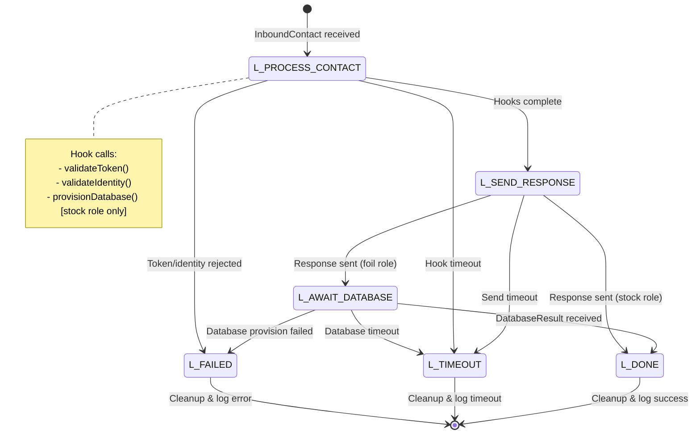
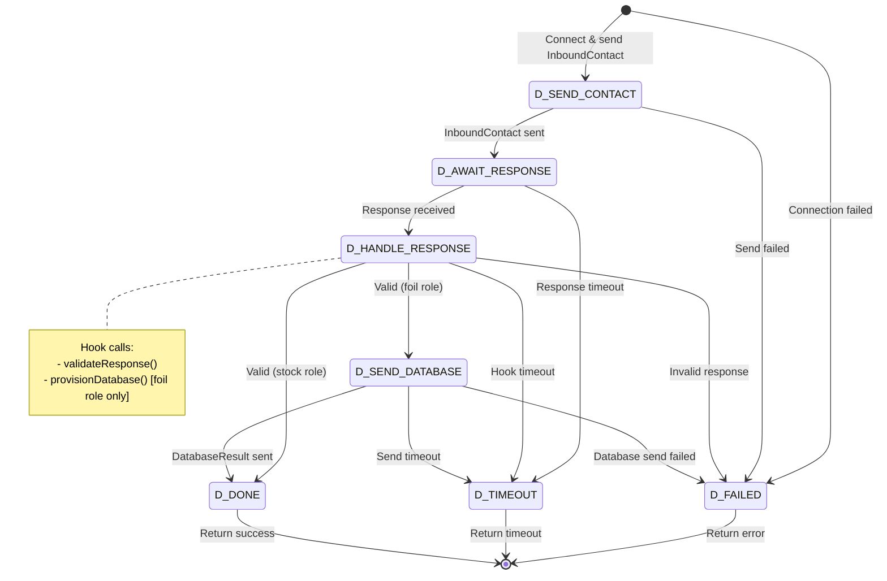
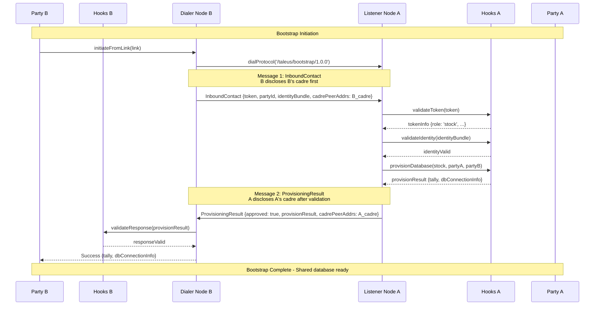
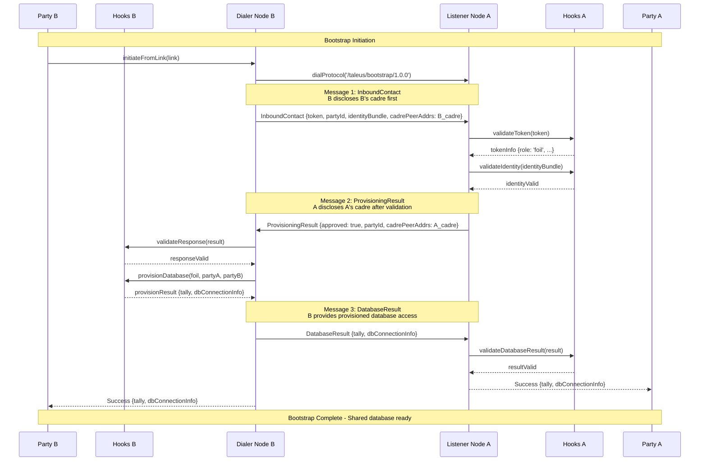
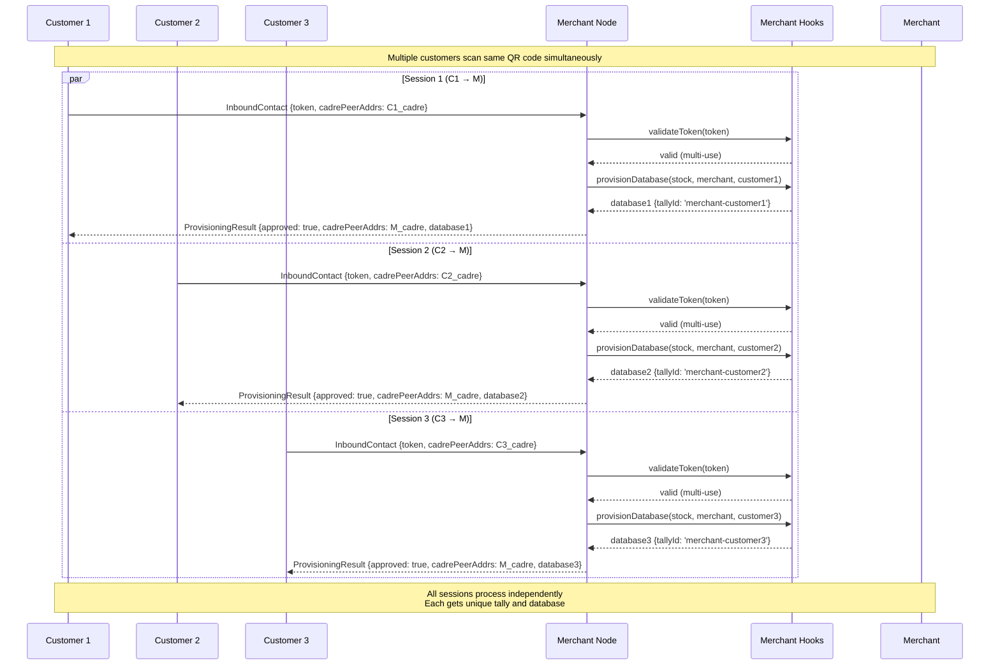

# Taleus Bootstrap: State Machine Architecture

This guide explains the production state machine architecture for Taleus bootstrap. The bootstrap process establishes shared databases and minimal draft tallies between two parties to enable tally negotiation.

## State Machine Overview

The Taleus bootstrap uses a **session-based state machine** architecture optimized for concurrent processing, fault tolerance, and production money system requirements.

### Key Design Principles

- **Session Independence**: Each bootstrap attempt runs in an isolated session
- **Concurrent Processing**: Unlimited parallel bootstrap sessions
- **Timeout Protection**: Multi-level timeouts prevent hangs and resource leaks
- **Error Isolation**: Failed sessions don't affect other sessions
- **Resource Management**: Automatic cleanup and monitoring
- **Audit Trail**: Complete logging for money system compliance

---

## Session State Diagrams

### ListenerSession Class (Party A - Receives Connections)



### DialerSession Class (Party B - Initiates Connection)



---

## Protocol Message Flow

### Stock Role Bootstrap (A provisions database)



### Foil Role Bootstrap (B provisions database)



### Concurrent Multi-Use Token Handling



---

## Class Architecture

### SessionManager Class

The `SessionManager` coordinates all bootstrap operations, managing both listener and dialer sessions.

```typescript
class SessionManager {
  private listenerSessions = new Map<string, ListenerSession>()
  private dialerSessions = new Map<string, DialerSession>()
  private hooks: SessionHooks
  private config: SessionManagerConfig
  
  constructor(hooks: SessionHooks, config?: SessionManagerConfig) {
    this.hooks = hooks
    this.config = { sessionTimeoutMs: 30000, maxConcurrentSessions: 100, ...config }
  }
  
  // Handle incoming streams (passive listener)
  async handleNewStream(stream: LibP2PStream): Promise<void> {
    const sessionId = this.generateSessionId()
    const session = new ListenerSession(sessionId, stream, this.hooks, this.config)
    
    this.listenerSessions.set(sessionId, session)
    
    // Process session independently (non-blocking)
    session.execute().finally(() => {
      this.listenerSessions.delete(sessionId)
    })
  }
  
  // Initiate bootstrap (active dialer)
  async initiateBootstrap(link: BootstrapLink, node: LibP2P): Promise<BootstrapResult> {
    const sessionId = this.generateSessionId()
    const session = new DialerSession(sessionId, link, node, this.hooks, this.config)
    
    this.dialerSessions.set(sessionId, session)
    
    try {
      return await session.execute()
    } finally {
      this.dialerSessions.delete(sessionId)
    }
  }
}
```

### ListenerSession Class

Handles incoming bootstrap requests from other parties.

```typescript
class ListenerSession {
  private state: ListenerState = 'L_PROCESS_CONTACT'
  
  constructor(
    private sessionId: string,
    private stream: LibP2PStream,
    private hooks: SessionHooks,
    private config: SessionConfig
  ) {}
  
  async execute(): Promise<void> {
    try {
      await this.processContact()
      await this.sendResponse()
      
      if (this.tokenInfo.role === 'foil') {
        await this.awaitDatabase()
      }
      
      this.transitionTo('L_DONE')
    } catch (error) {
      this.transitionTo('L_FAILED', error)
    }
  }
}
```

### DialerSession Class

Initiates bootstrap requests to other parties.

```typescript
class DialerSession {
  private state: DialerState = 'D_SEND_CONTACT'
  
  constructor(
    private sessionId: string,
    private link: BootstrapLink,
    private node: LibP2P,
    private hooks: SessionHooks,
    private config: SessionConfig
  ) {}
  
  async execute(): Promise<BootstrapResult> {
    try {
      const stream = await this.connectAndSend()
      const response = await this.awaitResponse(stream)
      
      if (this.tokenInfo.role === 'foil') {
        await this.sendDatabase(stream)
      }
      
      this.transitionTo('D_DONE')
      return this.result
    } catch (error) {
      this.transitionTo('D_FAILED', error)
      throw error
    }
  }
}
```

### SessionHooks Interface

Applications implement these hooks to provide business logic.

```typescript
interface SessionHooks {
  // Token validation and management
  validateToken(token: string): Promise<TokenInfo>
  markTokenUsed?(token: string, sessionId: string): Promise<void>
  
  // Identity validation  
  validateIdentity?(bundle: unknown, requirements?: unknown): Promise<boolean>
  
  // Database provisioning
  provisionDatabase(
    role: PartyRole,
    initiatorPeerId: string,
    respondentPeerId: string,
    sessionId: string
  ): Promise<DatabaseResult>
  
  // Response validation (for dialers)
  validateResponse?(response: ProvisioningResult): Promise<boolean>
  
  // Audit logging
  logSessionEvent?(sessionId: string, event: SessionEvent): Promise<void>
}
```

---

## Basic Usage

### Setting Up the Bootstrap Service

```typescript
import { SessionManager } from 'taleus/bootstrap'
import { createLibp2p } from 'libp2p'

// 1. Implement hooks for your application
const hooks: SessionHooks = {
  async validateToken(token: string) {
    const tokenData = await yourTokenStore.get(token)
    if (!tokenData || tokenData.expires < Date.now()) {
      return null
    }
    return {
      role: tokenData.role,
      expiryUtc: tokenData.expires.toISOString(),
      identityRequirements: tokenData.identityRequirements
    }
  },
  
  async provisionDatabase(role, initiatorPeerId, respondentPeerId, sessionId) {
    const tallyId = generateTallyId(initiatorPeerId, respondentPeerId)
    const database = await yourDatabaseService.create(tallyId, role)
    
    return {
      tally: {
        tallyId,
        createdBy: role,
        initiatorPeerId,
        respondentPeerId,
        createdAt: new Date().toISOString()
      },
      dbConnectionInfo: {
        nodes: database.nodeAddresses,
        credentials: database.accessToken
      }
    }
  }
}

// 2. Create session manager
const sessionManager = new SessionManager(hooks, {
  sessionTimeoutMs: 30000,
  maxConcurrentSessions: 50
})

// 3. Set up libp2p node and register bootstrap protocol
const node = await createLibp2p({
  addresses: { listen: ['/ip4/0.0.0.0/tcp/9000'] },
  // ... other libp2p config
})

node.handle('/taleus/bootstrap/1.0.0', ({ stream }) => {
  sessionManager.handleNewStream(stream)
})

await node.start()
```

### Passive Listening (Receiving Bootstrap Requests)

```typescript
// The session manager automatically handles incoming streams
// Each stream becomes a new ListenerSession that processes independently

console.log('Bootstrap service listening on /taleus/bootstrap/1.0.0')
console.log('Ready to accept incoming bootstrap requests')

// Monitor active sessions
setInterval(() => {
  console.log(`Active listener sessions: ${sessionManager.getActiveListenerCount()}`)
}, 5000)
```

### Active Initiation (Starting Bootstrap Requests)

```typescript
// Create a bootstrap link (typically done out-of-band)
const bootstrapLink: BootstrapLink = {
  token: 'your-bootstrap-token',
  responderPeerAddrs: ['/ip4/192.168.1.100/tcp/9000/p2p/12D3KooW...'],
  role: 'stock', // or 'foil'
  identityRequirements: { email: true }
}

// Initiate bootstrap to another party
try {
  const result = await sessionManager.initiateBootstrap(bootstrapLink, node)
  
  console.log('Bootstrap successful!')
  console.log('Tally ID:', result.tally.tallyId)
  console.log('Database nodes:', result.dbConnectionInfo.nodes)
  
  // Now you can connect to the shared database and begin tally negotiation
} catch (error) {
  console.error('Bootstrap failed:', error.message)
}
```

This architecture provides **clean separation** between the two session types while maintaining **simple APIs** for integration into applications.
