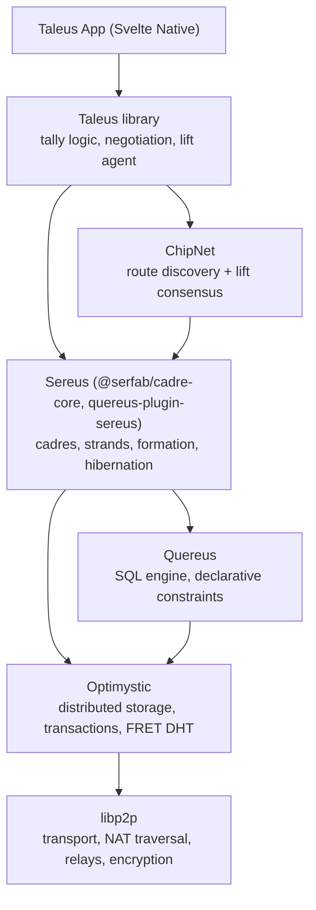

# Taleus Architecture

Taleus is a reboot of [MyCHIPs](https://github.com/gotchoices/mychips) on the [Sereus](https://sereus.org) platform. It implements private credit relationships (**tallies**) as peer-to-peer shared databases, and clears value around the resulting credit graph using cooperative **lift** transactions.

Documentation from the pre-Sereus prototype is preserved in [`docs/old/`](old/) for historical reference only.

## Heritage: What Changes from MyCHIPs

MyCHIPs is a hosted client/server system: each user has an account on a service provider's PostgreSQL database, a tally is duplicated across the two parties' databases, and a bespoke consensus protocol (hash-chained chits, message-based reconciliation) keeps the two copies in agreement. Lifts are coordinated by site servers using ChipNet for route discovery and commit.

Taleus removes the hosted layer entirely:

| Concern | MyCHIPs | Taleus |
|---|---|---|
| User presence | Account on a provider's server | **Cadre**: the user's own devices (phone + optional cloud/NAS nodes) via Sereus |
| Tally storage | Two copies, one per party's server DB | **One shared database**: a private two-party Sereus strand, replicated across both cadres |
| Tally consistency | Hash-chained chits + reconciliation protocol | Optimystic distributed transactions + schema-enforced signature constraints |
| Data model | PostgreSQL schema, chits "wedged into" one table | Quereus declarative sApp schema; discrete, revisioned, insert-only tables |
| Tally formation | Ticket/token protocol between servers | Sereus strand formation (`/sereus/formation/1.0.0`) + in-strand party seating |
| Denomination | All tallies denominated in CHIPs | **Contract chooses the denomination**; exchange rates connect tallies of different units |
| Lifts | Site servers run ChipNet over the tally graph | Party agents run the lift protocol directly, peer-to-peer, across denominations |
| Client | Mobile app talking to user's server | Svelte Native app embedding a cadre node — the app *is* a peer |

What carries over unchanged: the stock/foil tally model, chit semantics (signed pledges of value), credit terms, trading variables (bound/target/margin/clutch), contract references, and the lift concept. Nomenclature stays MyCHIPs-compatible.

## The Stack

- **Sereus** provides invitation-based formation, per-strand libp2p networks, membership/RBAC, multi-device cadres, hibernation, and mobile wake. See [`../../sereus/docs/architecture.md`](../../sereus/docs/architecture.md).
- **Quereus** executes the Taleus sApp schema. Its `verify()`-gated CHECK constraints are the enforcement point for all tally cryptography — every insert must carry a valid signature or the distributed transaction fails.
- **Optimystic** replicates the strand's data across the cohort (both parties' cadres) and provides transaction atomicity.
- **ChipNet** ([gotchoices/chipnet](https://github.com/gotchoices/chipnet)) discovers lift routes through the tally graph and coordinates atomic multi-tally commits. Its transport is callback-based, so Taleus carries its messages over the parties' existing peer links.

## Core Concepts

- **Party**: a person or entity. Within a tally, identified by a `Sid` (party ID — hash of the first-revision party key) and represented on the network by their Sereus cadre.
- **Tally**: a credit relationship between exactly two parties, embodied as one private, closed, two-party strand. The **stock** holder is normally the vendor/creditor side; the **foil** holder the client/debtor side.
- **Denomination**: the unit of account a tally is kept in — CHIPs, a national currency, or any unit the parties agree on. Chosen in the contract; fixed for the tally's life.
- **Chit / Ledger entry**: a signed pledge of value from one party to the other, as an integer count of the denomination's smallest unit. The net sum of chits is the tally balance.
- **Contract**: the legal agreement governing the tally, referenced by content address (CID) and accepted by both signatures. Its arguments carry the denomination and each party's credit terms.
- **Credit terms**: limits and call terms each party extends to the other.
- **Trading variables**: per-party automation parameters (`target`, `bound`, `reward`, `clutch`) that tell the lift agent what balance changes this party will accept and at what cost.
- **Exchange rates**: per-party quotes for converting between the denominations of that party's own tallies, letting lifts cross denomination boundaries.
- **Lift**: an atomic transaction around a cycle (or chain) in the tally graph that shifts balances without changing anyone's net worth — the credit-clearing mechanism.

## A Tally Is a Strand

Each tally maps to exactly one Sereus strand:

- **Closed strand, two members.** The strand carries a membership key; only the two parties (and their cadre nodes) can read or write it. The cohort is the union of both parties' cadres, so the tally survives any single device being offline.
- **sApp schema.** The strand applies the Taleus schema ([`schema/`](../schema/)) alongside the standard Sereus `Strand` membership schema. All tally rules live in the schema as constraints — there is no trusted server to enforce them.
- **Latency hint `interactive`.** A party may hold hundreds of tallies; nearly all hibernate nearly all the time. Sereus's hibernation system (check-in wake, push wake to suspended phones) brings a tally strand online when a chit, negotiation step, or lift touches it.
- **50/50 governance.** Both parties' cadres participate in the strand's Optimystic cohort. Neither party can unilaterally rewrite history: rows are insert-only and every mutation is signature-gated by the schema, so even a party whose nodes outnumber the other's cannot forge the other's signature.

The party-level *portfolio* — which tallies I hold, my exchange-rate quotes, in-flight lift bookkeeping, app preferences — is private state: never shared into any tally strand, yet visible to *all* of the party's own devices (phone plus any always-on cloud/NAS node that runs the lift agent). It replaces the MyCHIPs user database and lives in its own **single-party Sereus strand**, described under [Portfolio](#portfolio).

## Tally Formation

Formation reuses Sereus strand formation end-to-end (the pre-Sereus "Method 6" bootstrap protocol in `docs/old/bootstrap.md` is superseded).

1. **Invite.** The initiating party (conventionally the stock holder) pre-creates the closed tally strand and mints a Sereus `FormationInvite` bound to it, sharing it out-of-band (QR code, link, message). The invite carries the invitation keypair's secret — the same key the Taleus schema uses to seat the invited party.
2. **Formation handshake.** The invitee dials `/sereus/formation/1.0.0` with the token and its identity disclosure. The responder validates, records `FormationUsage`, and returns the strand ID plus membership key. Both parties' cadres add the strand and begin participating.
3. **Party seating (Taleus schema).** Inside the strand, the parties bind their tally identities:
   - The initiator inserts its `Stock` row: its `Sid` and the invitation *public* key, signed by its party key.
   - The invitee proves possession of the invitation secret by signing its `Foil` row with it, and registers its `PartyKey` revision 1 — the genesis of its authorized-key set (also validated against the invitation key).
   - Each party publishes a `PartyCertificate` (identity disclosure — progressively enriched by revision).
4. **Negotiation.** Either party proposes a contract (`TallyContractProposal`) with its arguments — denomination, credit terms; the tally becomes operative when both signatures land on the same contract revision (`TallyContract`).
5. **Open.** Ledger entries are now accepted.

Progressive disclosure: certificates are revisioned, so a party can start minimal and disclose more as trust develops; the counterparty simply declines to countersign a contract until satisfied.

## Schema and Integrity Model

The schema ([`schema/`](../schema/)) follows a few uniform rules:

- **Insert-only.** Tally tables carry `constraint InsertOnly check (0) on delete, update`. History is never rewritten; state advances by appending revisions.
- **Signature-gated inserts.** Every row's validity constraint recomputes a digest over the row's semantic fields and verifies the signature against the correct key. Because a party recognizes a *set* of authorized keys (not one "current" key), each signed row names the key that signed it in a `SignerKey` column; the constraint checks that `SignerKey` is in that party's authorized set (the `AuthorizedKey` view) at insert, then verifies the signature against it. The set's roots are resolved *from the database itself* — the invitation key for the genesis `PartyKey`, and an already-authorized key for every later add. A row that doesn't verify never commits, on any honest node.
- **Deferred-constraint snapshots.** A CHECK that contains a subquery is evaluated at commit (Quereus auto-defers it), where a plain table reference sees the transaction's own new rows and `committed.<table>` sees the pre-transaction snapshot. Constraints that assert "before this change" facts — the monotonic revision counter, and the rule that a key cannot authorize *itself* into the set — read `committed.*` so the row being inserted is excluded.
- **Monotonic revisions.** Revisioned tables enforce `Revision = max(prior) + 1` at insert.
- **Balance chaining.** Each `Ledger` row states the running `Balance`; a constraint verifies it equals the prior row's balance plus this row's signed `Units`. This replaces the MyCHIPs chit hash-chain — the chain lives in the shared, consensus-replicated table rather than being reconciled between two databases.

Tables:

| Table | Purpose |
|---|---|
| `TallyCore` | Tally identity: the founding fields (party `Sid`s, protocol version, creation time) whose hash is the tally CID that all other signatures bind to. Single row. |
| `Stock` | Initiator's binding: `Sid` + invitation public key, self-signed. Single row. |
| `Foil` | Invitee's binding: `Sid` signed with the out-of-band invitation secret. Single row. |
| `PartyKey` | Per-party **authorized-key set**, recorded as add-events: revision 1 (genesis) validates against the invitation key and its public-key hash *is* the party's `Sid`; every later revision is a new key authorized by an already-authorized one. Identity is stable; the set of keys evolves. |
| `PartyKeyRevocation` | Forward-only revocation: names a key to remove from a party's authorized set, signed by an authorized key. Past rows signed by the revoked key stay valid; only future inserts by it are rejected. A guard forbids emptying the set. |
| `PartyKeyAdoption` | Counterparty re-key ceremony: the one path that adds a key to a party's authorized set *without* an existing key of that party. The recovering party self-signs a fresh key (possession) and the counterparty attests it with an authorized key (human trust). `Sid` is unchanged — re-keys an existing party, never a new identity. Last-resort recovery when every authorized key is lost. |
| `PartyCertificate` | Revisioned identity disclosure per party, signed with an authorized key of the party. |
| `TallyContractProposal` | Either party's proposal of a contract CID + arguments (denomination, credit terms) — the negotiation cursor. |
| `TallyContract` | Bilaterally signed contract acceptances, numbered; the highest fully-signed number governs. |
| `TradingVariable` | Each party's published lift policy, revisioned: `Target` (ideal balance to accumulate via lifts), `Bound` (maximum to accrue), `Reward` (fee ratio for accumulation above target), `Clutch` (fee ratio for drops). MyCHIPs semantics, expressed from the issuing party's perspective. |
| `Invoice` | Signed payment requests; answered by a matching chit from the payer. |
| `Ledger` | Chits: issuer, units (positive integer, smallest denomination unit), date, reference/memo, issuer signature, chained balance. Distinguishes direct chits from lift chits, including the pending-lift state. |

Alongside the tables, the schema defines views. `RegisteredKey` is every key ever introduced for a party — normal `PartyKey` adds plus counterparty-attested `PartyKeyAdoption` keys — and `AuthorizedKey` is that set minus every `PartyKeyRevocation`: the authoritative "who may sign for this party right now" set that all signature-gated tables resolve their `SignerKey` against. The rest compute lift capacity in place: `PerspectiveBalance` (the chained balance as each party sees it — positive means accumulated value) and `LiftLading` (per direction: units movable free up to the receiver's target, further units to its bound at the receiver's `Reward`, with the releasing party's `Clutch` applied to the whole amount). Trading variables live in the shared strand deliberately — they are signed, unilateral policy the counterparty's lift agent must read to advertise route capacity. Exchange rates, by contrast, span multiple tallies and stay in the party's private **portfolio** — a separate single-party strand ([Portfolio](#portfolio)), never this shared tally strand, so no counterparty ever reads them.

### Why constraints instead of a consensus protocol

In MyCHIPs, the two copies of a tally could diverge, so a chit consensus protocol existed to reconcile them. In Taleus there is one logical database; Optimystic's transaction layer orders writes, and Quereus constraints decide validity identically on every node. A malicious party can refuse to participate (liveness), but cannot commit a row the schema rejects (safety). Each party's cadre retains a full replica, so either party can always prove the tally's signed state in a dispute — the same evidentiary property MyCHIPs' hash chains provided.

### Key recovery

A party signs its tally rows with keys from its `PartyKey` authorized set, not a single "current" key. That set is what makes losing a device survivable, and it deliberately mirrors the way a Sereus **cadre** recognizes a *set* of `AuthorityKey`s rather than one key (see [`../../sereus/docs/architecture.md`](../../sereus/docs/architecture.md), *AuthorityKey* / multi-authority cadres). Two recovery paths follow:

- **Cadre-assisted recovery (device loss — the common case).** Each of a party's cadre nodes (phone, plus any cloud/NAS node) can register its own key on a tally. If the phone is lost, a surviving node's key is still authorized: it signs a `PartyKeyRevocation` for the lost key and registers the replacement device's key, with no counterparty involvement. This is the tally-layer counterpart of Sereus's "a surviving cadre node re-enrolls a fresh device" after an enclave loss (see *Reinstall & recovery behavior* in the Sereus docs). Where each key's *secret* actually lives — one key per device enclave, versus a single key replicated across the cadre's control network — is a Sereus-layer concern, not modeled in the tally schema.
- **Total loss (every authorized key gone).** The set is empty and nothing inside the tally can sign a new key into it; the `NotLastKey` guard on revocation deliberately keeps a party from revoking its way into this state. Recovery then needs the human trust between the two parties — a bilateral **counterparty re-key ceremony**, recorded in `PartyKeyAdoption`. This is the one path that introduces a key into a party's authorized set *without* an existing key of that party, so it is deliberately bilateral: the recovering party generates a fresh key out-of-band and **self-signs** it (proving possession), and the **counterparty attests** it with one of its own currently-authorized keys (the human "yes, this really is you"). The party's `Sid` is unchanged — the ceremony re-keys an existing party, it never mints a new identity, so all history stays valid and the two-party invariant holds. Once the adopted key is authorized, normal add/revoke resumes: the party registers its new devices' keys and revokes the lost/stolen ones (now permitted, because `NotLastKey` sees the adopted key). Adoption is allowed even when the set is non-empty, which also serves the all-keys-*stolen* case — an honest party gets a counterparty-blessed fresh key *before* revoking the thieves. The counterparty is the recovery trust root: its attestation is the only thing authenticating the recovering party, so a malicious counterparty can unilaterally re-key its counterpart — it generates (or reuses) a key it controls, self-signs, and attests with its own authorized key, satisfying every guard alone. That is inherent to a two-party human-trust root and out of scope by design: the self-signature proves only that the adopted key is a real keypair whose holder consented, not *which* party generated it, because in total loss the recovering party has no surviving secret to prove it with. The app must surface the counterparty's attestation as the trust decision it is.

Regaining tally-signing authority this way is the **app layer**, and it presupposes the recovering party can still read and write the closed strand. A party that lost all its cadre nodes also lost its **Sereus strand-membership key** and its **cadre authority keys**, so the counterparty must *first* re-admit the party's fresh cadre into the strand at the Sereus layer (the invite → join handshake, `addMemberByAuthority` — see [`../../sereus/docs/architecture.md`](../../sereus/docs/architecture.md), *Invite → join handshake* and *Reinstall & recovery behavior*). The ordering is therefore two-layer: **Sereus re-invite (regain strand access) → Taleus `PartyKeyAdoption` (regain signing authority).** Taleus does not reinvent strand re-admission — it depends on the Sereus mechanism, the same way cadre-assisted device recovery mirrors Sereus's surviving-node re-enrollment rather than inventing a parallel scheme.

Because a stolen key's *past* signatures were checked once at insert and are never re-validated, revocation is forward-only: it cannot retroactively invalidate history, only stop future signatures. The gap between a key being compromised and its revocation committing is an inherent race in a two-party unilateral-chit ledger — bounded in practice by fast revocation, tally close, and the counterparty ceremony.

## Portfolio

The **portfolio** is a party's private financial state — the list of tallies it holds, its exchange-rate quotes, its in-flight lift bookkeeping, and its app preferences. It replaces the MyCHIPs user database. Two properties define it: it is **private** (never shared into any tally strand, so no counterparty ever reads it) yet must be **visible to all of the party's own devices** — the phone and any always-on cloud/NAS node that runs the lift agent, which reads quotes and lift state at decision time.

### Why a single-party strand

The portfolio lives in its own **single-party Sereus strand** — a closed strand whose only member is this party, carrying the Taleus portfolio schema ([`schema/portfolio.qsql`](../schema/portfolio.qsql)). A single-member closed strand is a supported Sereus configuration (the founder-bootstrap / solo path), and its cohort is just this party's own cadre, so ordinary strand replication carries the portfolio to every one of the party's nodes, including the always-on lift-agent node.

The alternative — stuffing this state into the Sereus **control network** (the private Optimystic network of only the party's own cadre nodes) — was rejected: the control network's schema is platform-owned (`Strand`, `AuthorityKey`, `CadrePeer`, …; see the Sereus docs, *Control Network*), and Sereus's own guidance keeps application data in an sApp strand, not the control schema. A single-party sApp strand cleanly separates app state, reuses strand replication + hibernation, and is naturally caught by the phone's existing `sAppId:taleus` strand filter.

**Same `sAppId`, two schemas.** The phone runs one cadre node with one strand filter (`sAppId:taleus`), so both the portfolio strand and every tally strand share `sAppId = taleus` to be picked up. `sAppId` is a filter tag, not a schema identity — each `Strand` row names its own sApp schema, so one `taleus` sAppId hosts both the two-party tally schema ([`schema/draft1.qsql`](../schema/draft1.qsql)) and the single-party portfolio schema. The app tells a portfolio strand from a tally strand by the `PortfolioCore` marker row (below), not by member count — a tally mid-formation is also briefly one member.

### Tables

The portfolio schema keeps the house style of the tally schema — **insert-only, revisioned, latest-wins views** (it mirrors `TradingVariable`) — but carries **no signatures**. The tally schema is signature-gated because it defends against a counterparty; the portfolio's cohort is a single cadre (the party's own devices), so the Sereus strand-membership layer (only this cadre may write) is the sole write gate and no `verify()`/signature constraint is needed. State advances by appending a revision; a view exposes the current row.

| Table | Purpose |
|---|---|
| `PortfolioCore` | Singleton marker + owner identity (`OwnerSid`). Its presence is how the app recognizes a strand as *the* portfolio (a tally strand has `TallyCore` instead). |
| `TallyRegistry` | One revisioned entry per tally the party holds — role (stock/foil), counterparty, cached denomination/state/certificate/balance. A **display index** over the party's tally strands, not authoritative tally state. |
| `LiftJournal` | In-flight lift bookkeeping: the agent's cross-tally correlation of a lift in progress (which lift, which edges, what state). The authoritative per-edge state is the pending lift chit in each tally strand's `Ledger`; this is the private map the agent drives discovery/commit from. |
| `AppPreference` | Revisioned key/value app settings (display currency, notification preferences, …). |
| `ExchangeRateQuote` | The party's per-denomination exchange-rate quotes (added by `feat-exchange-rate-quotes`); private, revisioned, unsigned. See [Denominations and Exchange](#denominations-and-exchange). |

**Identification.** Among the `sAppId:taleus` strands, *the* portfolio is the one carrying a `PortfolioCore` row whose `OwnerSid` equals this party's own `Sid`. This is self-locating — there is no external pointer to lose, and the marker (not member-count-of-one) is what distinguishes it from a tally strand mid-formation.

### Consistency across devices

Both the phone and the always-on node are members of the same single-party strand cohort, so plain Optimystic replication carries a write from one to the other. There is no cross-party consensus (single party), only intra-cadre replication. No read-your-writes guarantee is asserted *across* devices: if the phone edits a rate quote and the write has not yet replicated when a lift decision fires on the always-on node, the agent reads the prior revision — acceptable, and for rate quotes bounded by the quote's own validity window. Concurrent edits from two devices each append a new revision; the `(Key/StrandId/LiftId, Revision)` primary key plus Optimystic write ordering serialize them (the same mechanism as concurrent `PartyKey` adds), rejecting the loser's duplicate revision — latest committed revision wins, the loser retries against the new max.

### Recovery

The portfolio is the *map* of the party's financial life, so losing it must not lose tallies — and it does not:

- **Tallies recover independently.** Each tally is its own strand whose cohort includes the counterparty; it is recovered via cadre membership + `PartyKeyAdoption` ([Key recovery](#key-recovery)), entirely without the portfolio.
- **The registry is reconstructible.** `TallyRegistry` is an index over strands the cadre already belongs to. The control network's `Strand` view lists every strand this cadre operates; re-enumerating the `sAppId:taleus` strands and reading each tally's `TallyCore`/`TallyContract` rebuilds the registry from scratch. A lost portfolio strand therefore costs no tally.
- **Quotes, lift journal, and preferences are NOT reconstructible** — they are private policy/bookkeeping with no external source. Their durability rests on the portfolio strand replicating to a durable node (the always-on cloud/NAS node the party adds for the lift agent) plus optional user export. A phone-only party that loses its phone loses its quotes and preferences (not its tallies) — the same durability tradeoff Sereus states for a single-device cadre. The portfolio is **not** recoverable from counterparties.

### First-launch reconciliation (double-create)

Two of the party's devices can both check "no portfolio exists yet" and both create one at first bring-up (they share the control network's `Strand` view), yielding two portfolio strands. The schema cannot prevent this — they are separate strands. The app-wiring layer ([`backlog/feat-portfolio-app-wiring`](../tickets/backlog/feat-portfolio-app-wiring.md)) resolves it deterministically: on detecting more than one portfolio strand for `OwnerSid`, keep the one with the lexicographically-lowest `StrandId`, migrate the loser's rows into it, and drop the loser from the cadre. Migration is **not** a blind append — the revisioned tables are keyed `(StrandId|LiftId|Key, Revision)`, so a loser row whose key already exists in the survivor collides on the primary key (and on `RevisionMonotonicInt`). Migration therefore re-inserts each loser row at the survivor's current `max(Revision)+1` for that key; where both devices independently advanced the *same* key, the later-migrated revision wins (a last-writer-wins reconciliation, acceptable for private cache/preference state). `PortfolioCore` is a singleton *per strand* with no revision — the survivor already has its own, so the loser's identical marker is simply discarded, not migrated. The schema side is built to survive all of this: every table is keyed so the survivor can absorb the loser's rows by renumbering, and nothing is signature-gated, so a device may write the migrated rows freely.

## Denominations and Exchange

Every tally is kept in the denomination its contract names. CHIPs remain the reference unit for the network at large, but a tally between an employer and employee can be kept in an hourly wage unit, a merchant tally in a national currency, and so on. `Ledger.Units` is always an integer count of the denomination's smallest unit (the contract defines the scale, e.g. milliCHIPs or cents).

Denominations partition nothing: the tally graph stays one graph, and lifts cross denomination boundaries at the parties that hold tallies in more than one unit. Such a party quotes **exchange rates** — private trading policy in its portfolio — stating the ratio at which it will pass value between two of its tallies' denominations (typically with its conversion cost or spread folded in, the multi-denomination generalization of `reward`).

Consequences for payments and lifts:

- A **payment** is specified in the *recipient's* tally denomination — the payer's intent is "the payee receives X units on their end", and the path found may enter and leave several denominations on the way.
- **Route discovery** carries denomination along with capacity: each hop advertises what it can pass and at what rate, and the discovered route accumulates the conversion product end-to-end, so the originator sees the exact source-denomination cost of delivering the target amount before committing.
- **Lift terms are fixed at commit.** The signed lift record binds each edge's units in that edge's own denomination — every tally's ledger stays internally consistent in its own unit, and no participant is exposed to rate movement after signing.
- A **circular clearing lift** in a single denomination is the degenerate case: all rates 1, exactly the MyCHIPs behavior.

## Ledger Operation

- **Direct payment**: issuer inserts a `Ledger` row pledging `Units` to the other party, signed with one of the issuer's authorized `PartyKey`s (named in the row's `SignerKey`). Balance convention: foil-issued chits increment, stock-issued decrement (see `BalanceCorrect`).
- **Invoice**: requester signs an `Invoice` row; the payer answers with a chit referencing it.
- **Lift chit**: inserted in a pending state during a lift, bound to the lift ID and referee; finalized by the referee's commit signature or voided by its timeout/abort. Pending chits reserve capacity — trading variables and credit checks see them.

## Lifts and ChipNet

A lift clears credit around a cycle: each participant pays one neighbor and is paid by another, net zero for everyone, but balances move back toward targets. A linear lift (payment) does the same along a chain from payer to payee. Requirements:

1. **Route discovery** through a graph nobody sees globally — each party knows only its own tallies — now including denomination and rate at each hop.
2. **Atomic commit** across many independent tally strands — all lift chits finalize, or none do.

ChipNet provides both. Its transport is callback-based rather than socket-bound: Taleus supplies comms callbacks that carry ChipNet messages to tally partners over a lightweight libp2p protocol between cadres (`/taleus/chipnet/1.0.0`). Each tally is an edge; the **lift agent** in each party's cadre participates in discovery and commit on that party's behalf — the role MyCHIPs site servers played, now played by the party's own always-on node (or phone, best-effort). Parties without an always-on node participate opportunistically while awake; routes preferentially flow through continuously reachable agents.

Mapping onto strands:

- A **pending lift chit** is written into each participating tally strand, conditioned on the lift ID and referee, denominated in that tally's own unit per the committed route's rates.
- The lift **commit record** (referee signature over the lift terms) finalizes the chit in every strand independently — each strand's schema verifies the referee signature locally, so no cross-strand transaction is needed.
- Each tally's `LiftLading` view (from the trading variables both parties publish in the strand) tells the agents how many units may flow on each edge and at what fee; the party's portfolio exchange rates add the cross-denomination conversion.

## Client Application

- **TypeScript + Svelte Native** (NativeScript). The app embeds a cadre node directly (`@serfab/cadre-core`), with strand filter `sAppId:taleus` so it only participates in tally strands plus the user's control network.
- Mobile nodes run the **transaction profile** (no storage rings); users who want durability add a cloud/NAS/home node to their cadre (`cadre-host`, `cadre-cli`, or a provider) — that node replicates every tally strand and serves as the always-on lift agent.
- Storage on device via Quereus's NativeScript plugin (`quereus-plugin-nativescript-sqlite`); the Taleus library itself is platform-neutral and also runs in Node (headless agent) and the browser.
- App surfaces: tally list + balances (per denomination), formation (QR invite/scan), negotiation (certificates, contract, terms), payments/invoices, lift activity, and cadre management (delegated to Sereus UX patterns).

## Tally Lifecycle

| State | Meaning |
|---|---|
| Forming | Strand exists, parties seating / negotiating; no signed contract yet |
| Open | Contract bilaterally signed; ledger active |
| Closing | Close requested; only balance-reducing chits accepted |
| Closed | Balance zero after close request; strand may hibernate permanently / be archived |
| Void | Formation abandoned before contract signature |
