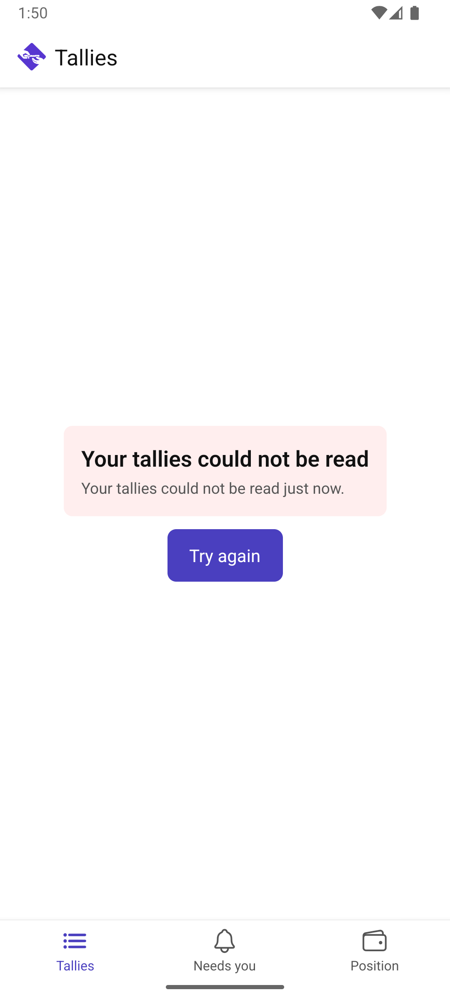

# Scenario: Finding a tally

Source: [06-find-a-tally.md](../../../stories/mobile/06-find-a-tally.md)

Jan holds several tallies, in three different units. The question this screen answers is "where do I
stand, and does anything want me?" — without opening anything.

## Step 1: Every tally, readable without opening it

Who it is with, what it counts in, where the balance stands from Jan's side, and when it last moved.
Two rows want him and say so.

Rae's row is an outstanding invitation rather than an open tally: it leads with its state and carries
no figure, because an offer has no balance and is not "settled" (path C). Dave's row is six hours and
seven minutes — `07/60` — which is why amounts here are written as a whole number and a common
fraction and never with a decimal point.

## Step 2: A party with no tallies at all

Not an error, and it does not read like one. Jan is told what a tally is and offered both ways to get
one.

## Alternates

**The list cannot be read.** Distinct from having none: it says so plainly, and offers to try again
because trying again could help.

## Not shown

Reaching a tally by unit, by recency, or by anything the counterparty disclosed — story 06's steps 2
to 5 — needs sorting, filtering and search, which are unsliced. The fixture is six tallies; the story
describes forty, and path B's three counterparties with the same name have never been on screen.
