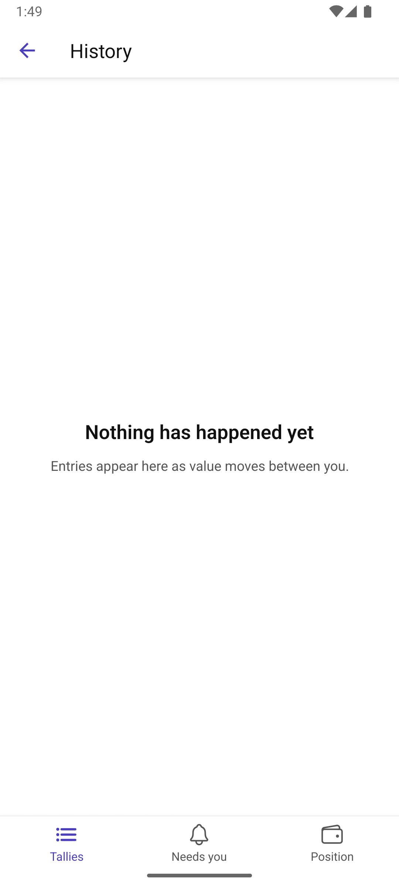

# Scenario: Finding a tally, and reading one

Source: [06-find-a-tally.md](../../../stories/mobile/06-find-a-tally.md),
[04-first-look-at-an-open-tally.md](../../../stories/mobile/04-first-look-at-an-open-tally.md),
[07-review-the-agreement.md](../../../stories/mobile/07-review-the-agreement.md)

Jan holds several tallies, in three different units. He wants to answer "where do I stand, and does
anything want me?" without opening anything.

## Step 1: Every tally, readable without opening it

Who it is with, what it counts in, where the balance stands from Jan's side, and when it last moved.
Two rows want him and say so. Rae's row is an outstanding invitation, not an open tally: it leads
with its state and has no balance, because an offer has no balance and is not "settled".

Amounts are written as a whole number and a common fraction — Dave's row is six hours and seven
minutes, `07/60`, which no decimal point could say.

## Step 2: What a tally is

The balance leads, described from Jan's side so neither party works out a sign. Terms appear in both
directions, each labelled by who extended it and each with its own effective date — they took effect
on different days. Room to spend is its own figure, described as credit Sam extended, never as value
Jan holds.

## Step 3: A tally with nothing on it yet

Story 04's actual scene: a zero that is explained rather than an empty result.

## Step 4: A unit that does not divide by ten

Dave's hours divide into sixty minutes. The denominator appears because the digit count cannot say
it — `07` alone would read as seven hundredths.

## Step 5: Following the balance back

Every entry carries the balance that resulted, stated from Jan's side, so today's figure can be
followed rather than trusted. Outstanding requests sit beside the ledger, never in it, each saying
which way it runs.

## Alternates

**The counterparty is unreachable.** Story 04 path C: this is Jan's record too, so the tally and its
terms still read. What needs Sam is described as pending, not failed.

**Nothing can be read at all.** Distinct from the above — the list itself failed, and says so.

**A tally with no history.**

**Other tallies worth opening**, registered but not photographed:

- [The other side of a balance](taleus://screen/TallyView/tally%3Amara-shop?variant=happy) — what Jan owes
- [A tally that is closing](taleus://screen/TallyView/tally%3Asupplier-parts?variant=happy)
- [An entry that answered a request](taleus://screen/TallyHistory/tally%3Amara-shop?variant=happy)

## Not shown

Sorting, filtering and search are story 06's own paths and are unsliced — the list is six tallies, not
the forty the story describes.
