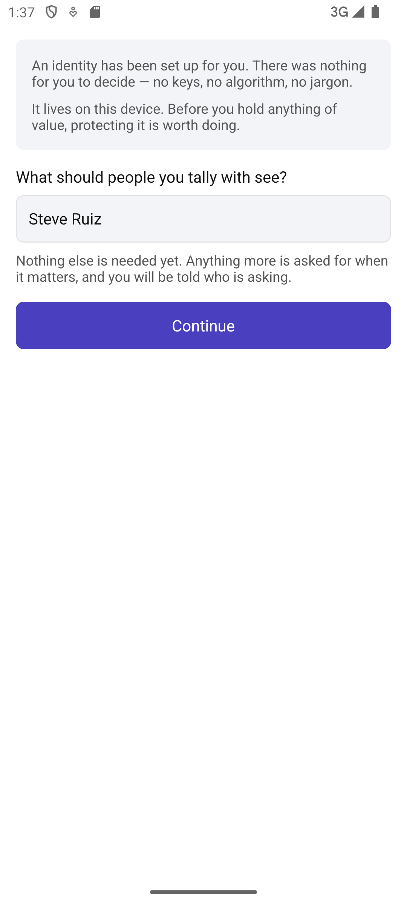

# Scenario: First run

Source: [10-first-run.md](../../../stories/mobile/10-first-run.md)

Steve has followed MyCHIPs for years and installs Taleus out of curiosity. He has no invitation
waiting, nobody to tally with, and no idea what the app expects of him.

Reachable only with `variant=empty` — the default party fixture is an established identity, so the
app otherwise goes straight to the tabs.

## Step 1: Told what this is, before being asked for anything

Two lines about what a tally is and what value means here — enough to decide whether to continue.
Story path D is the constraint: he can read this *without anything having been created*. No identity
exists at this point.

## Step 2: An identity exists, and he is told so

Tapping through creates it. There were no keys to understand, no algorithm to choose, nothing to
name — step 3 is emphatic that this is bookkeeping the app does. He is then told, once, that it
lives on this device and what that implies before he holds anything of value (step 4).

Below that sits the one thing he is asked for (step 5), and the promise that makes deferring the rest
honest: anything more is asked for when it matters, and he will be told who is asking.

## Step 3: A name, and nothing else

The prompt below the button is gone once there is a name. There is no optional field here at all —
an optional field is still an ask.

## Step 4: No tallies, and what he needs

First run ends here (step 6). Rather than an empty list he is told what he needs — someone to tally
with — and offered both ways to get there.

Steve is not ready to invite anyone. Nothing he has done obliges him to anybody (step 7).

## Alternates

**Path A — Sam's route, invitation first.** Sam installs because Jan sent him something. Setting up
happens on the way to answering, and he lands on Jan's invitation rather than on an empty app. The
link is held while first run completes and re-delivered after; `ReviewInvitation` is not yet sliced,
so there is nothing to photograph.

**Path B — an identity already exists.** Continuing as himself on a replacement phone rather than
starting over. Stories 13 and 50; unsliced, and deliberately not offered as a button that goes
nowhere.

**Path C — no connectivity.** Nothing in this scenario needs the network. Identity creation is local,
so the whole flow above completes on a plane.

**Path E — being findable.** Publishing an invitation others can take up, before ever having tallied.
`StandingInvitation`; unsliced.
