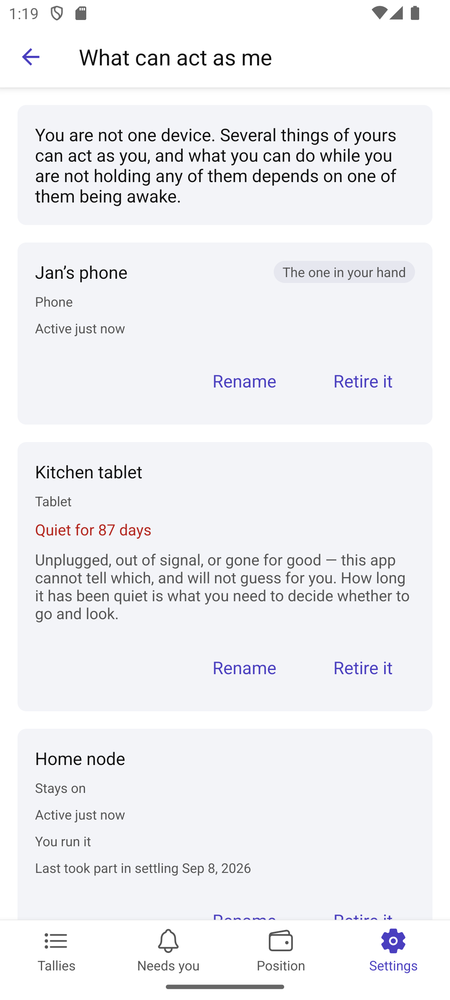
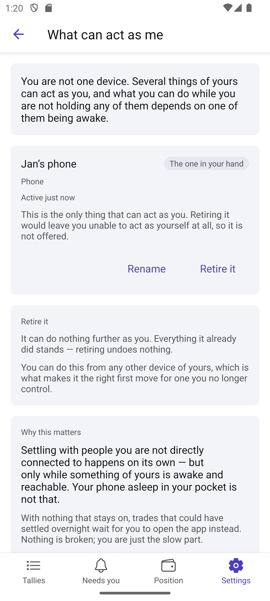

# Scenario: What can act as me

Source: [13-my-devices.md](../../../stories/mobile/13-my-devices.md)

More than one thing can act as a party — and whether any of them is awake decides whether their
tallies keep working while nobody is looking.

## Step 1: What they are, as things the party owns

Named by the party, not identified by a machine. The one in their hand is marked as such, so a list
of three is not three identifiers to decode.

## Step 2: One that has not been carried in months

Eighty-seven days quiet, and the screen stops there. Unplugged, out of signal or gone for good are
indistinguishable from here, and the app says so rather than guessing on the party's behalf (path B).
How long it has been quiet is what they need to decide whether to go and look.

## Step 3: The thing a party has no way to work out

Settling with people they are not directly connected to happens on its own — but only while something
of theirs is awake and reachable. A phone asleep in a pocket is not that. Nothing else in the app
teaches this; balances that move while they are looking and sit still while they are not do not
explain themselves.

Jan has a node that stays on, so he is told it is handled rather than told off. And he can see it
working: when it last took part.

## Step 4: A party with only a phone

Path A. Not an error and not a defect — stated as what they miss. Trades that could have settled
overnight wait for them to open the app instead. "Nothing is broken; you are just the slow part."
The fix is offered once, in the same breath, and not repeated.

## Step 5: Retiring, described before it is needed

Said once for all of them, because the sentence is the same: it stops future acts and undoes nothing
already done. It can be done from any other device of theirs — which is exactly what makes it the
right first move for a phone somebody else is holding (path C).

Two things prevent it, and they are different failures. The last remaining device is refused outright
with the reason, on that device's own card (path D). One that cannot be reached is a retry: nothing
changed, and they can try again.

## Not shown

Keys themselves — what this phone is actually holding, and getting back after losing it (stories 12
and 50). `RecoverySetup` waits on off-device custody. How a party actually stands up something that
stays on is left to the platform by the story itself; adding one records the decision.
