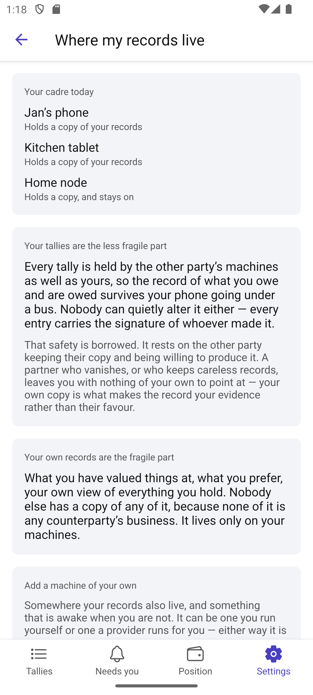
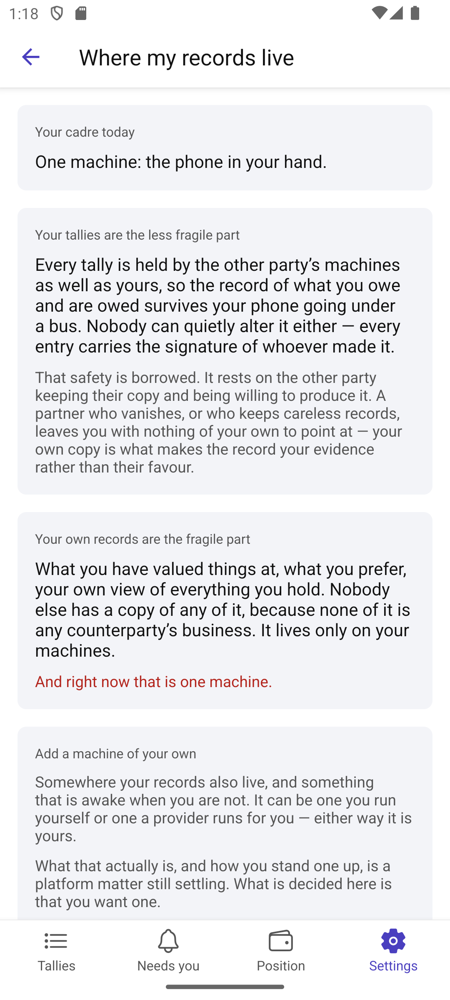

# Scenario: Where my records live

Sources: [14-my-cadre.md](../../../stories/mobile/14-my-cadre.md),
[51-change-my-address.md](../../../stories/mobile/51-change-my-address.md)

The same machines `Devices` lists, asked a different question: what would survive losing one?

## Step 1: What each machine actually does

Holds a copy of your records; stays on so your tallies keep clearing; or both. A phone gives the
first and not the second, which is the whole of why adding something changes anything.

## Step 2: Tallies are the less fragile part — and why that is borrowed

The counterparty holds every tally too, so the record survives a phone going under a bus, and nobody
can quietly alter it because every entry carries a signature.

The next sentence is the one that matters: **that safety is borrowed.** It rests on the other party
keeping their copy and being willing to produce it. A partner who vanishes, or who keeps careless
records, leaves the party with nothing of their own to point at. Their own copy is what makes the
record their evidence rather than their partner's favour. Saying the first half without the second
would be the app promising something it does not control.

## Step 3: Their own records are the fragile part

What they valued things at, what they prefer, their own view of everything they hold. Nobody else has
a copy, because none of it is any counterparty's business.

Said in those words. There is no infrastructure vocabulary anywhere on this screen — path A asks for
the consequence in the party's own terms, and "replication" is not that.

## Step 4: A party running only a phone

Told once, accurately, and not nagged. The fragile half exists in exactly one place.

## Step 5: Somebody else offering to host it

Path B. A friend with an always-on machine is *not* the same decision as a machine of your own: the
party's private financial records would sit on somebody else's hardware. Stated with nothing to
press — the offer comes from the friend, not from this screen, and a button here would blur exactly
what the story says not to blur.

## Step 6: Nothing to arrange with anybody

Paths D and E, and story 51. Partners' machines are not added to anything and neither are the
party's. Replace a phone, move a node, change providers — as long as one machine is there at a time,
records move along and no partner has to be told.

And the number disclosed to a partner is something the party *told* them. It is not how their
machines find each other, and changing one is not changing the other.

## Not shown

Standing up a machine, choosing a provider, what one costs — story 14 leaves all of it to the
platform. Adding and retiring happen on [what can act as me](13-my-devices.md); this screen owns the
consequence and hands over.
