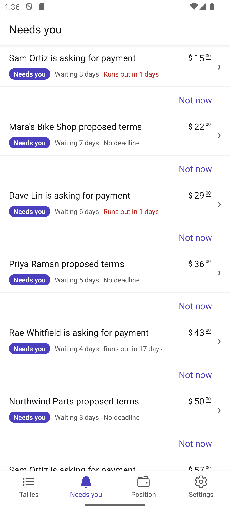
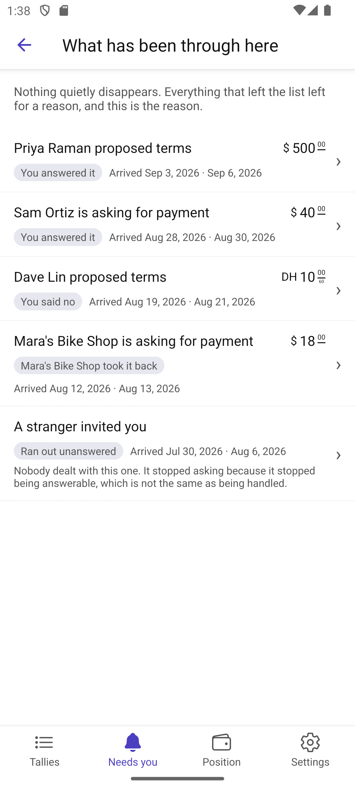

# Scenario: What needs my attention

Source: [23-what-needs-my-attention.md](../../../stories/mobile/23-what-needs-my-attention.md)

Everything waiting on this party, across every tally, so nothing has to be hunted for.

## Step 1: What is waiting, and for how long

Each item says who it involves, what it is, what it would cost, and how long it has waited. Items are
reachable — the point of the list is getting to the thing, not naming it.

Two absences are deliberate. Automated settling never appears: it was authorized in advance and needs
nothing. And items waiting on the *other* party appear plainly marked, so a party knows about them
without being asked for anything.

## Step 2: Urgent, or merely open

Path B. A request that runs out on Friday and an offer good for another month must not look alike,
and the party should not be doing the arithmetic to tell them apart. A deadline inside a week is
coloured; one further off is not; and something open-ended says so rather than leaving a gap where a
date would be.

## Step 3: Eleven things after a week away

Path C. They can be worked through without losing one's place, and what has already been dealt with
in this sitting is counted. The one waiting on somebody else sits apart and carries no action — path
D: it appears because the party should know about it, never as a demand on them.

## Step 4: Not now

Path F, and the one thing on this screen that must not be misread. Setting something aside stops it
asking; it does not answer it. Nothing reaches the counterparty, nothing is answered, and what the
party owes or agreed is untouched. The words on the screen say exactly that, and the word *refuse*
appears nowhere near it.

## Step 5: What became of everything else

Path E. Nothing quietly disappears: an item leaving the list is an event with an outcome, not an
absence. Answered, refused, withdrawn by the other party, run out unanswered, or set aside.

The two that are *not* answers say so. A lapsed item stopped being answerable, which is not the same
as being handled. A set-aside item is still unanswered, with nothing about it having ever reached the
other side — and it can be brought back whenever the party likes.

Nothing here is urgent, and nothing is styled as though it were: everything on this screen has
stopped asking.

## Step 6: Nothing waiting

A good state, and it reads like one rather than like a failure to load — with the way back to what
has already been through offered rather than hidden.

## Not shown

Path G — dealing with something on one device settling it on every device of theirs — needs the
engine. The screens are written so that arriving at an item already resolved reads correctly.
