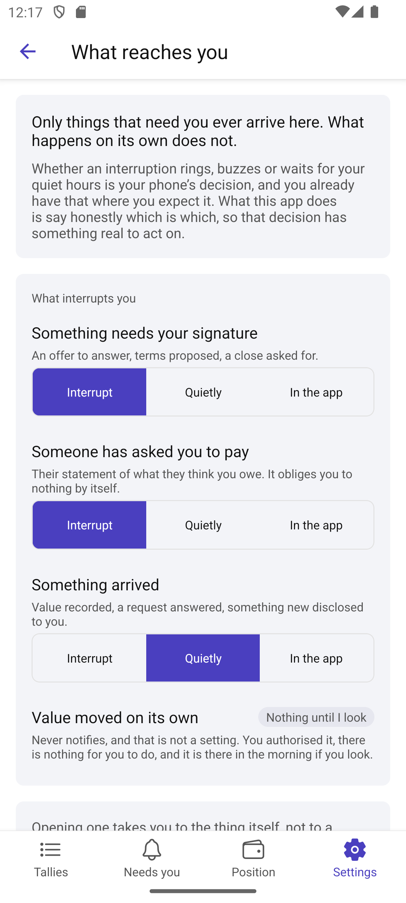
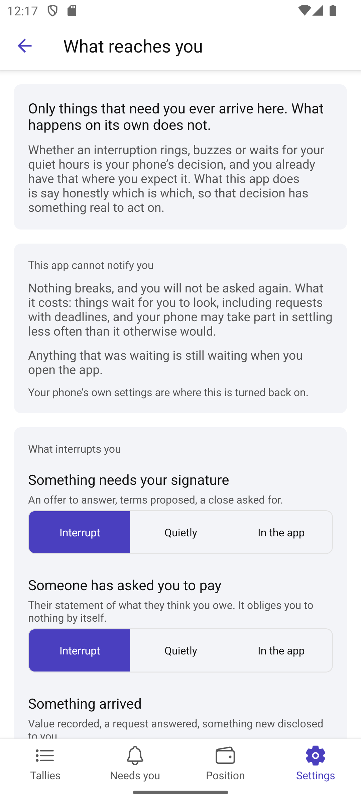

# Scenario: What reaches you

Source: [43-notifications.md](../../../stories/mobile/43-notifications.md)

Six screens in this app promise a counterparty is told something. This is where "told" is defined.

## Step 1: The app classifies; the phone decides

Whether an interruption rings, buzzes or waits for quiet hours is the phone's business, and the party
already has that where they expect it. There are deliberately no quiet hours here — a second set
would fight the first. What this app owes them is an honest classification, so the policy they
already set has something real to act on.

## Step 2: Four kinds of thing, and only one of them is fixed

Not sorted by which subsystem raised the event, but by what the party would actually ask. Something
needing a signature is not the same as something merely finishing (step 5), and they can be treated
differently.

*Value moved on its own* never notifies, and that is shown as a row rather than left out. The party
authorised it, there is nothing for them to do, and it is there in the morning if they look (path A).
Showing it fixed says the app is not quietly deciding its own events deserve them.

## Step 3: On a lock screen, in company

Path C. A phone lights up on a table between other people. What shows by default is enough to know
something wants you and nothing more — no amounts, no counterparty names, no balances.

The other choice is offered with the line it would actually put in front of whoever is standing
there, because the story says the party chooses *having been shown what that reveals*.

## Step 4: Landing, and arriving together

Opening a notice lands on the thing itself, not on a starting point to search from. Something already
dealt with — on this device or any other of theirs — says so rather than sending them somewhere with
nothing to do (step 3, step 4, path F). A busy afternoon is not a dozen separate interruptions (path
E). All stated as behaviour: a toggle for any of them would imply the other way was acceptable.

## Step 5: Taking part while nobody is holding the phone

Path B. Settling sometimes needs something of the party's to answer, and the phone can be roused
briefly to do it — showing them nothing, with nothing to read or dismiss. It is not a message.

It is best effort and the screen says so: a phone decides for itself what it will do unattended. Jan
has a node that stays on, so none of this rests on his handset.

## Step 6: A party with only a phone, and one with no notifications at all

Path B step 4 and path D together. Nothing that stays on means the answer is a machine of theirs —
not another setting in here, which is the one thing this app cannot supply.

And with notifications refused: nothing breaks, the party is not asked again, and what it costs is
said once. Anything that was waiting is still waiting when they open the app. The classes still read,
because turning it back on is the phone's business.

## Not shown

Any actual notification. Nothing in the app can raise one yet — no push transport, no permission
request, no background task. This screen is the policy those will read, which is the half that is a
design decision rather than a platform integration. Devices (13) and the cadre (14), which path B
points at, are unsliced and named in prose rather than linked into nothing.
